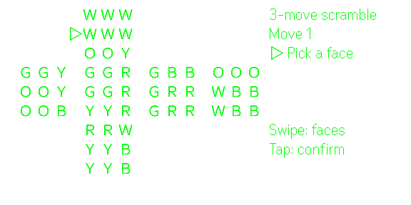
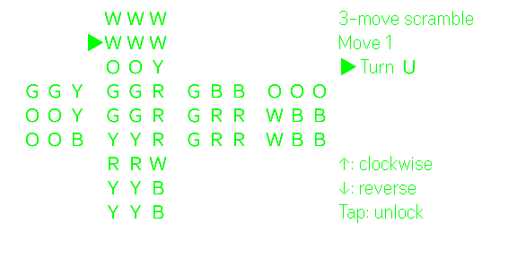
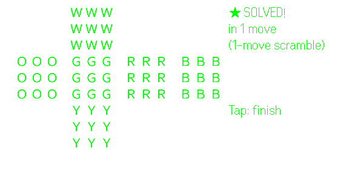
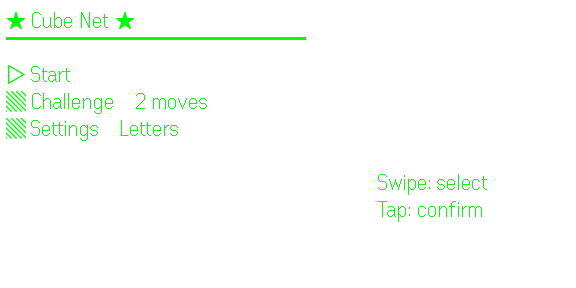
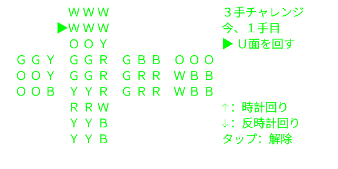
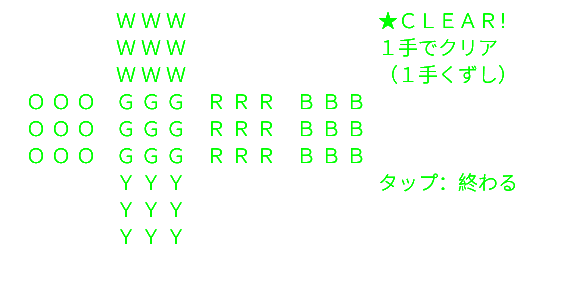
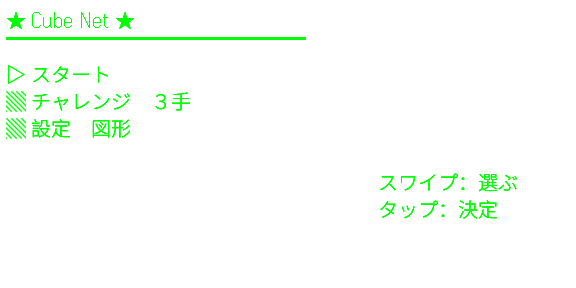
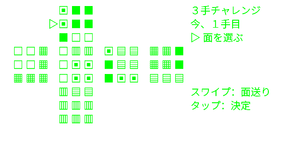

# CubeNet

*日本語の説明は[このページの下のほう](#日本語)にあります。*

A cube puzzle played flat: the whole cube is drawn as its unfolded net on
[Even Realities G2](https://www.evenrealities.com/) smart glasses, and you turn the faces with the R1 ring.

## How a round goes

- All six faces are in view at once, laid out as the unfolded cross
- Scramble it by 1–4 moves — from the phone, or from Start on the glasses
- Swipe to walk the `▷` marker across the net, tap to lock the face you want
- Swipe up to turn that face clockwise, down to turn it back — the face stays
  locked, so repeated swipes keep turning it
- Tap again to unlock and pick another face
- Solve it, and your move count is shown against the length of the scramble
- Every turn is saved, so you can leave mid-round and pick it up from Continue

A few moves deep is the whole idea: it is a short puzzle you can finish while
waiting for something, not a speedcubing session.

| Turning a face | Solved |
| --- | --- |
|  |  |

## Controls

| Ring input | Action |
| --- | --- |
| Swipe | Move the face marker / turn the locked face / move the menu cursor |
| Tap | Lock a face / unlock it / choose a menu item |
| Double-tap | Open the in-game menu (Back / Reset / Retire / Main menu) — exits from the title screen |

Retire does not just end the round: it replays the way back one ring action per
second, the way a player would do it, so you can watch the cube being undone.

## Menu and display

Faces can be drawn as letters or as shapes — whichever reads faster for you —
and the app runs in English or Japanese.

| Menu | Shapes instead of letters |
| --- | --- |
|  |  |

## Availability

Preparing for Even Hub submission — this page will be updated once the app is live.

Developed and tested on Android. iOS should work (same ring-input pattern as my
other G2 apps) — please report anything odd.

## About this repository

This repo hosts the built web bundle of the app (G2 apps are HTML/JS served
inside the Even App).

## Author

**TakeMotions** — X: [@r_tkbyc](https://x.com/r_tkbyc)

---

# 日本語

キューブを展開図のまま遊ぶパズルです。立方体を展開した形のまま
[Even Realities G2](https://www.evenrealities.com/) のグラスに映して、R1 リングで面を回します。

## 1ラウンドの流れ

- 6面ぜんぶが同時に見える、展開図（十字）のレイアウト
- 崩しは1〜4手。スマホからでも、グラスの「スタート」からでも
- スワイプで `▷` マーカーを展開図の上で動かし、回したい面でタップして固定
- 上スワイプでその面を時計回り、下スワイプで逆回り。面は固定されたままなので、
  続けてスワイプすればそのまま回り続けます
- もう一度タップで固定を解除して、別の面へ
- 揃うと、崩した手数に対して何手かかったかが出ます
- 1手ごとに保存されるので、途中でやめても「つづき」から再開できます

数手ぶんだけ、というのがこのアプリの狙いです。何かを待っている間に終わる短い
パズルで、スピードキューブの練習用ではありません。

| 面を回しているところ | 揃ったところ |
| --- | --- |
|  |  |

## 操作

| リング操作 | 動作 |
| --- | --- |
| スワイプ | 面マーカーの移動／固定した面を回す／メニューのカーソル移動 |
| タップ | 面を固定／解除／メニュー項目の決定 |
| ダブルタップ | ゲーム中メニューを開く（戻る／リセット／リタイア／メインメニュー）。タイトル画面では終了 |

リタイアはラウンドを終わらせるだけではありません。1秒に1動作ずつ、プレイヤーと
同じやり方で戻り道を再生するので、崩れが解かれていく様子をそのまま眺められます。

## 表示とメニュー

面は文字でも図形でも表示できます。読みやすいほうをどうぞ。表示言語は日本語と
英語を切り替えられます。

| メニュー | 文字のかわりに図形 |
| --- | --- |
|  |  |

## 公開状況

Even Hub への申請を準備中です。公開されたらこのページを更新します。

開発と動作確認は Android で行っています。iOS でも動くはずです（他の G2 アプリと
同じリング入力の作りです）。おかしなところがあれば教えてください。

## このリポジトリについて

アプリのビルド済みウェブバンドルを置いているリポジトリです（G2 アプリは Even App
の中で表示される HTML/JS です）。

## 作者

**TakeMotions** — X: [@r_tkbyc](https://x.com/r_tkbyc)
